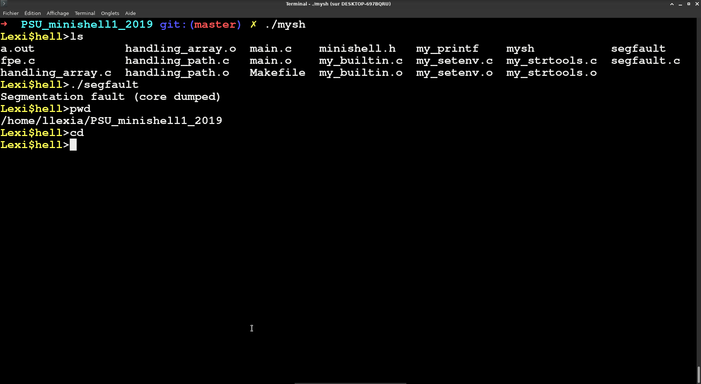

# PSU_minishell1_2019

Première partie du projet reproduisant un interpréteur de commande(shell). Principalement par gestion de la variable PATH d'un environement, possibilité d'effectuer des commandes basiques et une parties des builtins(cd et env notemment). Retours des messages d'erreurs types erreur de segmentation...

